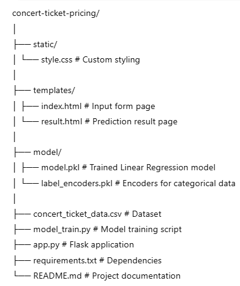
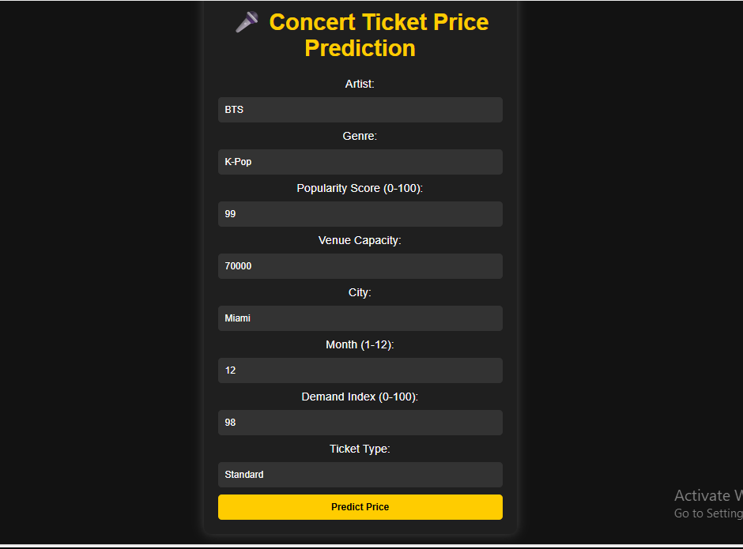
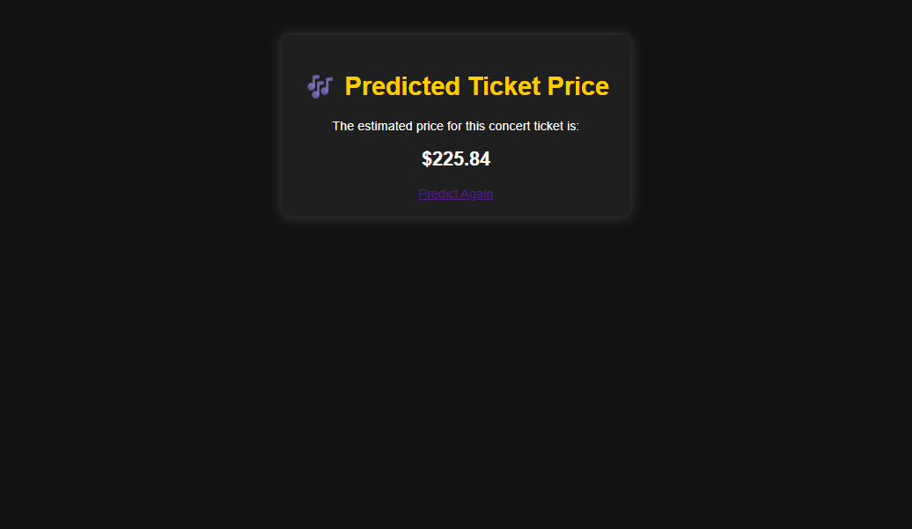

# 🎤 Concert Ticket Price Prediction (Linear Regression)

A **Flask-based Machine Learning web application** that predicts concert ticket prices based on artist details, venue capacity, popularity, and demand.  
The prediction is powered by a **Linear Regression** model trained on a small dataset of real and synthetic concert pricing data.

---

## 🔍 Overview
This project allows users to enter details about a concert and instantly get the **predicted ticket price**.  
The model considers multiple factors:
- 🎤 **Artist**
- 🎶 **Genre**
- ⭐ **Popularity Score**
- 🏟 **Venue Capacity**
- 🌆 **City**
- 📅 **Month**
- 📈 **Demand Index**
- 🎫 **Ticket Type**

---

## ✨ Features
- Predicts **ticket price** in real time
- Uses **Linear Regression** for prediction
- Pre-trained model saved as `model.pkl`
- Simple and clean **HTML/CSS frontend**
- Flask-powered backend API

---

## 🛠 Tech Stack
- **Python 3.10+**
- **Flask**
- **scikit-learn**
- **pandas**
- **numpy**
- **HTML/CSS**

---

## 📂 Project Structure

---

## ⚙ Installation & Setup

### 1️⃣ Clone the Repository

git clone https://github.com/yourusername/concert-ticket-pricing.git
cd concert-ticket-pricing

### 2️⃣ Install Dependencies

pip install -r requirements.txt

### 3️⃣ Train the Model

python model_train.py
This will create model.pkl and label_encoders.pkl inside the model/ folder.

### 4️⃣ Run the Web App

python app.py
Open in your browser:

http://127.0.0.1:5000/

### 📸 Screenshots

🎤 Input Form

📊 Prediction Result

### 💡 Use Cases
🎟 Concert event planning — Estimate fair ticket pricing

📈 Demand-based pricing strategies for music events

🎓 Machine Learning Regression demonstration

### 📌 Future Enhancements
Add more artists and genres to dataset

Integrate real-time demand data from APIs

Deploy online via Heroku, Render, or AWS
